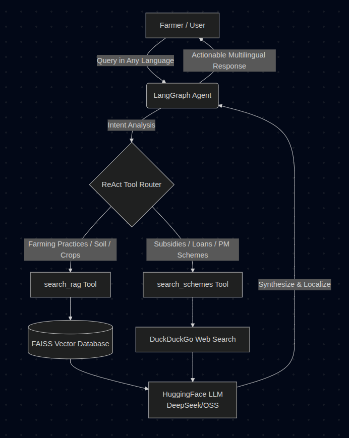
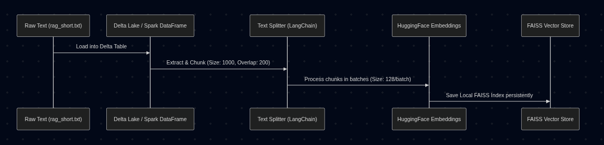

# 🌾 Fasal Mitra (फसल मित्र)

**Fasal Mitra** is an AI-powered, multilingual agriculture assistant designed to support Indian farmers. By combining **Retrieval-Augmented Generation (RAG)** for verified agricultural practices with **Agentic Web Search** for real-time government schemes, it provides reliable, actionable, and localized advice step-by-step.

**🔗 Try the Live App on Databricks:** [https://fmitra-7474650359868011.aws.databricksapps.com/](https://fmitra-7474650359868011.aws.databricksapps.com/)

---

## 🚀 Features
- **🗣️ Multilingual Support**: Detects and responds natively in Hindi, Bengali, Marathi, Telugu, English, and other Indian languages.
- **📚 Local Knowledge Base (RAG)**: Retrieves farming guidelines, crop practices, pest management, and soil health advice from a robust FAISS vector database.
- **🌐 Live Government Schemes**: Uses integrated web search to fetch the latest Indian government subsidies, PM schemes, and crop insurances.
- **🤖 Agentic Routing**: Intelligently decides when to search local storage vs. the web based on the farmer's query using the ReAct strategy.

---

## 🏗️ System Architecture

The application is orchestrated using **LangGraph**, employing a dynamic agent that reasons through the user's intent to select the appropriate tools.



---

## 🛠️ Technology Stack

**Databricks Ecosystem:**
- **Databricks Apps:** For scalable hosting and deployment of the Streamlit application.
- **Databricks Notebooks:** Used for development, data preprocessing, and vector store initialization.
- **Delta Lake & PySpark:** For robust data staging, storage, and processing (Delta tables and Spark DataFrames).

**Open Source Models:**
- **LLM Engine:** Open-source models hosted via HuggingFace Inference API (`deepseek-ai/DeepSeek-R1:fastest` and `openai/gpt-oss-120b:fastest`).
- **Embeddings:** `sentence-transformers/all-MiniLM-L6-v2` for generating embeddings to power the RAG pipeline.

**Application Framework:**
- **Agent Framework:** LangGraph, LangChain
- **Vector Database:** FAISS
- **Search Tool:** DuckDuckGo Search API
- **Frontend / UI:** Streamlit (via `app.py` / `dashboard.py`)

---

## ⚙️ Setup & Installation

**1. Clone the repository & Install Dependencies:**
```bash
git clone https://github.com/princeiiti/kisan-helpbot
cd final
pip install -r streamlit-hello-world-app/requirements.txt
```

**2. Environment Variables:**
Set your Hugging Face API key in your environment to enable LLM inference:
```bash
export HF_TOKEN="your_huggingface_token_here"
```

**3. Initialize Database (first-time only):**
Run or step through the Jupyter Notebook `New Notebook 2026-04-18 02_36_08.ipynb` to construct the FAISS vector database from your text data (`rag_short.txt`).

**4. Run the Streamlit Application:**
```bash
cd streamlit-hello-world-app
streamlit run app.py
```

---

## 📊 RAG Data Pipeline



---

## 💡 Usage Example

**User Input (Telugu):** 
> "గోధుమ పంటకు నీటిపారుదల చేయడానికి ఉత్తమ సమయం ఏమిటి మరియు ప్రభుత్వ పథకం ఏదైనా ఉందా?"
*(What is the best time to irrigate the wheat crop, and is there any government scheme?)*

**Agent Execution Output:**
1. Recognizes intent: Crop practice + Scheme inquiry.
2. Triggers `search_rag("wheat crop irrigation schedule")`.
3. Triggers `search_schemes("wheat crop farming schemes subsidies")`.
4. Synthesizes a unified response purely in **Telugu**, providing detailed irrigation steps and mentioning relevant PMKSY/insurance schemes.
